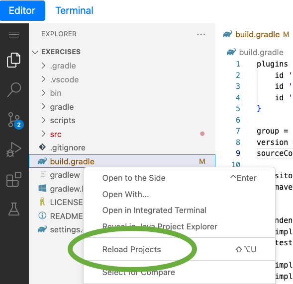

Recall from the lesson that Spring Security requires authentication for all endpoints by default. This is why each test is now failing, reporting that a `401` is returned instead of the expected status code.

To change the tests to provide authentication will take two steps.

1. Add the testing dependency.

   Open build.gradle again and add Spring Security's testing dependency like so:

   ```editor:open-file
   file: ~/exercises/build.gradle
   ```

   ```gradle
   dependencies {
     ...
     implementation 'org.springframework.boot:spring-boot-starter-security'
     ...
     testImplementation 'org.springframework.security:spring-security-test'
     ...
   }
   ```

   **_Note:_** You might need to reload the Java project to pull in the new dependency. Right-click on `build.gradle` and choose "Reload Projects".

   

1. Utilize `@WithMockUser` in the tests.

   Spring Security's testing support provides utilities that simulate a _principal_, such as an authenticated principal.

   This makes testing REST APIs easy!

   Add the `@WithMockUser` annotation to the top of the `CashCardApplicationTests` class, like so:

   ```editor:open-file
   file: ~/exercises/src/test/java/example/cashcard/CashCardApplicationTests.java
   ```

   ```java
   import org.springframework.security.test.context.support.WithMockUser;
   ...
   @SpringBootTest
   @AutoConfiguredMockMvc
   @WithMockUser
   public class CashCardApplicationTests {
    ...
   ```

   This tells Spring Security to provide a mock user whose username is "user" for each test. In this way, you can ensure that your security invariants are also being tested.

   Now, run the tests again, and they should all pass except for one: `shouldCreateANewCashCard`, which creates a new `CashCard`. Don't worry, this is expected!
