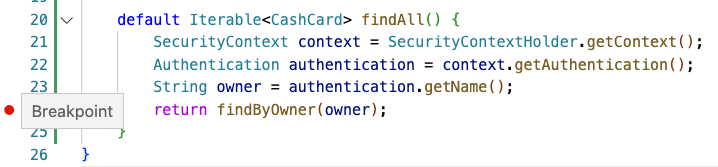

A great way to learn more about what's actually happening inside an application, is to debug the running app.

Using an IDE and its debugger allows you to inspect variables, and follow the code logic, as the application processes a request. Handy!

Let's use the debugger to inspect exactly what's happening with `SecurityContextHolder`.

1. Set a breakpoint.

   In the Editor, set a breakpoint by clicking on the left to select the `findAll()` `return` statement:

   ```editor:select-matching-text
   file: ~/exercises/src/main/java/example/cashcard/CashCardRepository.java
   text: "findAll"
   description:
   ```

   

1. Run the debugger.

   Please start the application in the Editor:

   ```editor:open-file
   file: ~/exercises/src/main/java/example/cashcard/CashCardApplication.java
   ```

   

1. Trigger the breakpoint.

   Now that the application is running in debug mode, execute the following to trigger the breakpoint:

   ```dashboard:open-dashboard
   name: Terminal
   ```

   ```shell
   [~/exercises] $ http :8080/cashcards "Authorization: Bearer $TOKEN"
   ```

1. See what's going on.

   Inspect the `authentication` object, and see that it not only has the `name`, but you can also get the `principal` (User) and its `authorities`; in this case, the `SCOPE_cashcard:read` and `SCOPE_cashcard:write` scopes.

   ```editor:select-matching-text
   file: ~/exercises/src/main/java/example/cashcard/CashCardRepository.java
   text: "findAll"
   description:
   ```

   

1. Continue on.

   Let the code continue, then take a look at the response in the Terminal.

   

   You should only see the `sarah1` cash cards.

   ```dashboard:open-dashboard
   name: Terminal
   ```

   ```shell
   [
       {
           "amount": 123.45,
           "id": 99,
           "owner": "sarah1"
       },
       {
           "amount": 1.0,
           "id": 100,
           "owner": "sarah1"
       },
   ]
   ```

Feel free to use these debugging techniques in future labs, or when revisiting previous labs!
